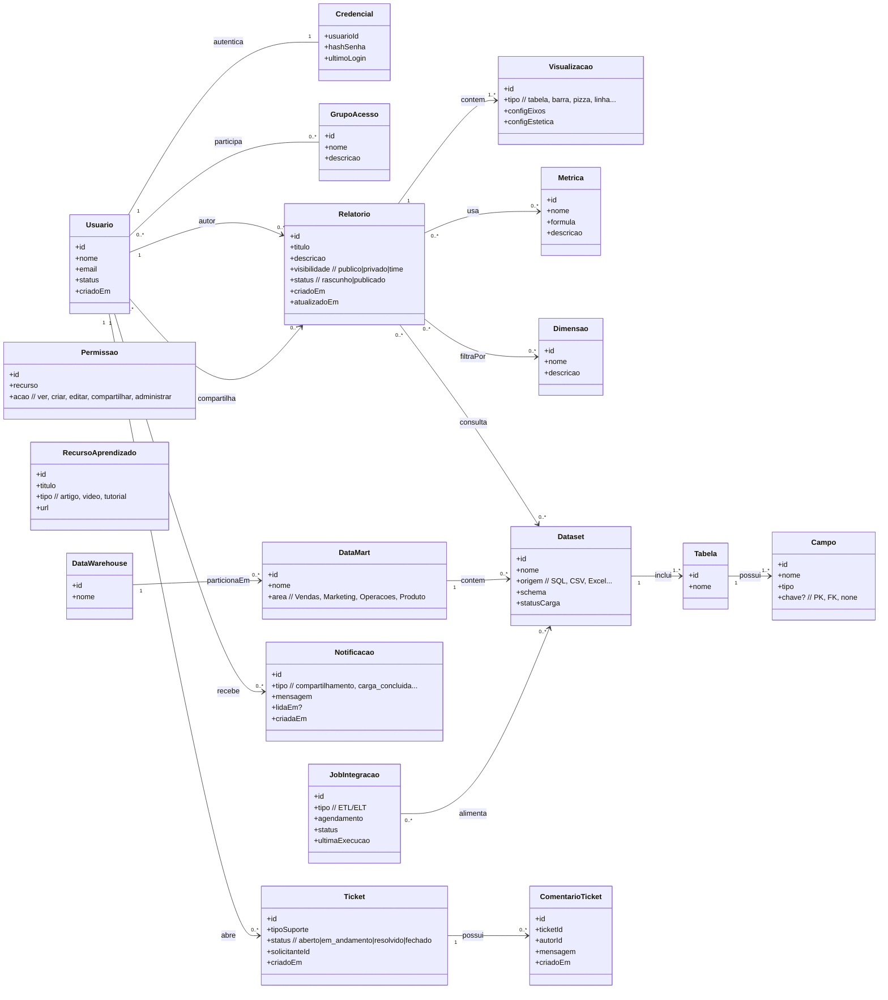

# Projeto de Business Intelligence para Marketplace

## Autores
Naomi Arakaki 10438010

Melissa Zanelato 10436651

Renato Gonçalves Ribeiro 10410267

Danilo Abude Gigliotti 10443431

Rafael Queiroz Moraes 10441847

# Cenário de Negócio e Concepção da Solução

Um marketplace generalista, que opera com um vasto leque de categorias de produtos, busca otimizar sua tomada de decisão de para serem orientadas a dados. Neste modelo, os vendedores parceiros (*sellers*) são responsáveis por anunciar seus produtos, gerenciar a logística de entrega, definir a precificação e executar as estratégias de marketing.

Problema Central: A ausência de uma ferramenta analítica centralizada dificulta a tomada de decisão, que pode ser baseada mais em intuição do que em dados concretos, gerando potenciais perdas de receita e oportunidades de crescimento.

> Assim, o sistema que vamos construir busca transformar o marketplace em uma organização **data-driven**, construindo um **Data Warehouse (DW)** centralizado como única fonte da verdade. A arquitetura será otimizada com **Data Marts** departamentais para garantir alta performance. Integrado a uma plataforma de **Business Intelligence (BI)**, o projeto visa democratizar o acesso a dados consistentes e acionáveis, fomentando uma cultura de decisões estratégicas baseadas em evidências.

### Clientes (Sponsors do Projeto)

Este grupo representa a liderança da empresa, responsável por aprovar, financiar e definir a direção estratégica do projeto.

-   **C-Level (CEO, COO, CFO, CMO):** Utilizarão os dashboards executivos para monitorar a saúde geral do negócio, tomar decisões estratégicas de alto impacto e reportar resultados ao conselho.
-   **Diretores e Chefes de Departamento (Vendas, Marketing, Operações, Produto):** São os principais clientes dos Data Marts departamentais. Eles patrocinam o projeto para obter autonomia e inteligência de dados para suas equipes, visando o cumprimento de metas e a otimização de suas áreas.

### Usuários Finais (Consumidores da Informação)

São os profissionais que irão interagir diretamente com a plataforma de BI no dia a dia para executar suas funções.

-   **Analistas de Dados e de BI:** Usuários avançados que irão construir dashboards, realizar análises complexas (ad-hoc) e disseminar insights pela organização.
-   **Analistas de Marketing:** Utilizarão a plataforma para segmentar clientes, medir o ROI de campanhas, analisar o funil de conversão e otimizar o orçamento de marketing.
-   **Gerentes de Categoria e Vendas:** Monitorarão o desempenho de vendedores (sellers), a performance de produtos, a competitividade de preços e a saúde de suas categorias.
-   **Analistas de Operações e Logística:** Acompanharão a eficiência das entregas, os custos de frete, os níveis de serviço do atendimento ao cliente e os indicadores de fraude.
-   **Gerentes de Produto (Product Managers):** Analisarão o comportamento do usuário na plataforma, o engajamento com novas funcionalidades e o desempenho da busca interna para guiar o roadmap do produto.

### Equipe do Projeto (Construtores e Mantenedores)

Este grupo é responsável pelo desenvolvimento técnico, manutenção e evolução da infraestrutura de dados.

-   **Engenheiros de Dados:** Responsáveis por construir e manter os pipelines de ETL/ELT, o Data Warehouse e os Data Marts, garantindo a qualidade e a disponibilidade dos dados.
-   **Desenvolvedores de BI:** Especialistas na ferramenta de BI escolhida, responsáveis por criar os modelos de dados semânticos, dashboards complexos e treinar os usuários finais.
-   **Administradores de Sistemas / DevOps:** Garantirão a infraestrutura, segurança e performance da solução em nuvem.

### Impactados Indiretos (Beneficiários do Ecossistema)

Embora não acessem a plataforma diretamente, estes grupos serão positivamente impactados pelas melhorias e otimizações que ela proporciona.

-   **Vendedores do Marketplace (Sellers):** Serão beneficiados por políticas mais justas e transparentes, insights sobre tendências de mercado (compartilhados pelo marketplace) e uma plataforma mais eficiente para vender seus produtos.
-   **Clientes Finais (Compradores):** Terão uma melhor experiência de compra através de uma plataforma mais estável, recomendações de produtos mais relevantes, um sortimento de produtos alinhado com suas buscas e um atendimento ao cliente mais ágil e eficaz.

### Fatores Críticos de Qualidade

O sucesso do produto será medido pela sua capacidade de entregar os seguintes atributos:

* Velocidade e Desempenho para uma tomada de decisão ágil.
* Baixa curva de aprendizado e interface intuitiva para promover a adoção em todos os níveis.
* Precisão e consistência dos dados e dos cálculos apresentados.
* Possibilidade de integração de novas fontes de dados.
* Capacidade de cálculo de novas métricas com os dados disponíveis.
* Permitir que os usuários criem seus próprios relatórios para explorar os dados de acordo com suas necessidades específicas e em poucos cliques, de forma independente.
* Possibilitar compartilhamento de relatórios entre os usuários.
* Controle de acesso para dados confidenciais.
* Abertura de tickets para relatos de problemas no sistema.
  
# Modelo de Casos de Uso

## Casos de Uso por Ator

### Usuário do Sistema

| Caso de Uso                       |
|-----------------------------------|
| Integrar de novas tabelas        |                            
| Acessar relatórios prontos       |                            
| Criar novo relatório             |                            
| Editar relatório                 |                            
| Compartilhar relatório           |                            
| Abrir ticket                     |                            
| Visualizar ticket                |                            
| Ir para a área de aprendizado    |                            
 

### Administrador do Sistema
| Caso de Uso                      |
|----------------------------------|
| Configurar permissões à bases de dados         | 
| Criar usuário                    |
| Excluir usuário                  |

### Sistema de Integração
| Caso de Uso                |
|----------------------------|
| Atualizar base de dados    |

---

## 2. Descrição Resumida dos Casos de Uso
### Usuário
* Visulizar relatórios prontos: O usuário terá uma interface na qual todos relatórios públicos estarão disponíveis para consulta e edição. 
* Criar novo relatório: Se os relatórios prontos não suprirem as necessidades, é possível criar um relatório do 0.          
* Integrar de novas tabelas: Exportar tabelas (de fontes como sql, excel, csv, etc) para que possam ser relacionadas com as tabelas já fornecidas.
* Editar relatório: Um relatório já feito pode ser modificado, alterando as etapas de criação.                         
* Compartilhar relatório: Os usuários selecionados receberão uma notificação com link para o relatório.          
* Abrir ticket: Havendo problemas no sistema ou necessidade de gerenciar permissões, um ticket será enviado à equipe de desenvolvimeno ou ao administrador do sistema.                  * Visualizar tickets: Acessar os tickets editados com duas informações (Solicitante, Tipo de Suporte, Status, Equipe de Suporte, Data de Envio).                                        
* Ir para a área de aprendizado: No próprio aplicativo haverá um link para a área de treinamento, na qual há tutoriais ensinando o passo a passo de cada um dos requisitos do usuário. 

### Administrador
* Configurar permissões à bases de dados: O administrador possui grupos com acesso à determinadas tabelas. Ao configurar permissões, o administrador exclui ou inclui um ou mais usuários nesses grupos.
* Criar usuário: Um novo acesso é criado (nome de usuário, senha e dados vinculados).
* Excluir usuário: Um acesso é excluido do sistema, bem como seus dados vinculados.

### Sistema de Integração
* Atualizar base de dados: depois de os dados da fonte já haverem sido processados, o Sistema de Integração automaticamente carrega os dados na Datawarehouse, notificando os usuários. 

---

## 3. Caso de Uso Crítico (Detalhado)

---

## 4. Diagrama de Caso de Uso (UML)

# Modelo de Domínio

## Visão Geral
Este domínio reflete os casos de uso do projeto (ver README do repositório), cobrindo criação e gestão de relatórios, integração de dados, controle de acesso, tickets e aprendizagem.

## Diagrama de Classes
> Renderizado via Mermaid.

# Prototipação

## Visão Geral
O  wireframe de baixa fidelidade demonstra como será o sistema proposto voltado ao usuário, demonstrando telas e navegabilidade.

## Wireframe
> Construído no Figma: [https://www.figma.com/proto/236UxaNNXcFcqY64SokYxX/WiereFrame?node-id=0-1&t=Kkw3uJPNmMQPzgfk-1](https://www.figma.com/design/236UxaNNXcFcqY64SokYxX/WiereFrame?node-id=0-1&m=dev&t=Kkw3uJPNmMQPzgfk-1)

### Login

### Home

### Construtor de Relatórios

### Integração de Tabelas

### Tickets

### Learning

### Admin

---

## 1. Levantamento de Requisitos

Os requisitos abaixo foram levantados individualmente pelos membros do grupo e, em seguida, **consolidados de forma colaborativa**

### 1.1 Requisitos Funcionais (RF)
| ID    | Descrição | Prioridade |
|-------|-------------------------|------------|
RF01 | O usuário deve autenticar no sistema. | Alta
RF02 | O usuário pode gerenciar relatórios. | Alta
RF03 | O usuário pode analisar e compartilhar relatórios. | Alta
RF04 | O administrador pode gerenciar usuários e permissões. | Alta
RF05 | O usuário pode gerenciar tickets de suporte. | Média
RF06 | O usuário pode consultar a Área de Aprendizado. | Baixa

### 1.2 Requisitos Não Funcionais (RNF)
| ID    | Tipo (FURPS+) | Descrição | Prioridade |
|-------|--------------|-----------|------------|
RNF01 | Usabilidade | O sistema deve ter interface intuitiva e fácil de usar. | Alta
RNF02 | Segurança | O sistema ter mecanismos para monitorar a segurança contra acessos não autorizados e vazamento de dados confidenciais. | Alta
RNF03 | Desempenho | Consultas e relatórios devem ser processados em no máximo 5 segundos para até 10 mil registros. | Alta
RNF04 | Usabilidade | O sistema deve ter baixa curva de aprendizado para promover a adoção em todos os níveis. | Alta
RNF05 | Confiabilidade | O sistema deve garantir precisão e consistência dos dados e dos cálculos apresentados. | Alta

---

## 2. Especificação de Requisitos 

[TG3 Especificação de Requisitos.pdf](https://github.com/user-attachments/files/22580370/TG3.Especificacao.de.Requisitos.pdf)

## Diagrama de Sequência 

*Benefícios do Design*

-Escalabilidade: Novas fontes de dados ou tipos de relatórios podem ser adicionados sem alterar a estrutura central.

-Reutilização: Serviços como FonteDeDadosService e NotificacaoService podem ser usados em outros casos de uso.

-Segurança e Controle: A camada de controle centraliza validações e verificações de permissão.

-Manutenibilidade: Separação clara entre camadas (MVC + GRASP) reduz impactos em futuras alterações.

## Resumo da Arquitetura e Benefícios

*Fluxo centralizado no RelatorioController (padrão Controller).

*Lógica de negócio isolada em RelatorioService (High Cohesion).

*Integrações desacopladas via FonteDeDadosService e RepositorioRelatorio (Low Coupling).

*Extensibilidade futura com suporte a novas fontes de dados (Polymorphism).

*Facilidade de manutenção e clareza na atribuição de responsabilidades (Information Expert).

